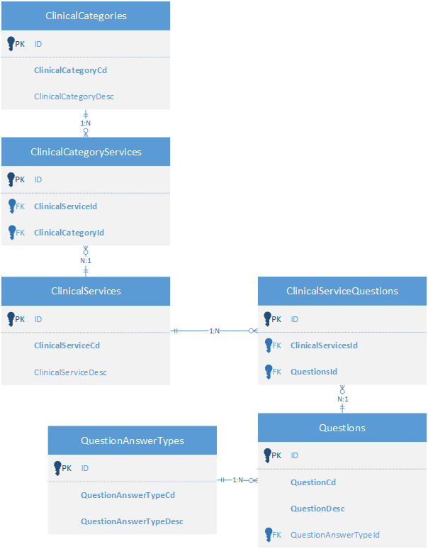

# Database Definitions
## Purpose 
To describe the database model in a meaningful manner relate to the product definition.

## Overview
Provides a brief landscape of the database. Details described below.

[DB Diagram Visio](DBDiagram.vsdx)

## Tables
### ClinicalCategories 
> List of all Clinical Categories: Diagnosis, Conservative Therapy, etc.
+ ID - PKID, Integer
+ ClinicalCategoryCd - Unique Code for each clinical Category
+ ClinicalCategoryDesc - Description, possibly UI display value to user.
+ CreateTimeStamp - Creation of this record.
+ LastUpdateTimestamp - LastUpdate of this record.

### ClinicalServices 
> List of all Clinical Services offered.
+ ID - PKID Unique Id 
+ ClinicalServiceCd - Unique Code for each clinical service.
+ ClinicalServiceDesc - Description of unique clinical service.
+ CreateTimeStamp - Creation of this record.
+ LastUpdateTimestamp - LastUpdate of this record.

> Possible extension point for: Weight of display Clinical Services, Predecessors, Successors

### ClinicalCategoryServices 
> ManyToMany relationship table with ClinicalServices from ClinicalCategories, describes this ClinicalCategory has these related Clinical Services
+ ID - PKID Unique Id
+ ClinicalServiceId - FK to ClinicalServices table.
+ ClinicalCategoryId - FK to ClinicalCategories table

### Questions 
> Describes a list of all possible questions.
+ ID - PKID Unique Id
+ QuestionCd - Unique code for each clinical service.
+ QuestionText - Text displayed to the user
+ QuestionAnswerTypeId - FK Reference to QuestionAnswerType, each question can only have 1 answer type.
+ CreateTimeStamp - Creation of this record.
+ LastUpdateTimestamp - LastUpdate of this record.

> Possible extension point for: Weight of display questions, new table for predecessors

### ClinicalServicesQuestions
> ManyToMany relationship of clinical services to the list of appropriate questions.
+ ID - PKID Unique Id
+ ClinicalServicesId - FK to ClinicalServices table.
+ QuestionsId - FK to Questions table.

### QuestionAnswerTypes
> Describes a list of all types of answers to given questions.
+ ID - Unique Id
+ QuestionAnswerTypeCd - Unique Code for each type of question answer.
+ QuestionAnswerTypeDesc - Description for this code.
+ CreateTimeStamp - Creation of this record.
+ LastUpdateTimestamp - LastUpdate of this record.