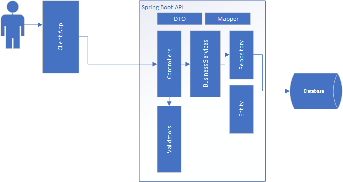

# Design Overview
## Purpose 
Describe the overall application design for the RESTful service component providing questions to the user
given a selected set of services.

## Background
Cohere provides a list of clinical categories IE: Diagnosis, Conservative Therapy, Surgery etc.
These categories are linked to multiple services that can be provided for given category. In turn, each service
has the ability to present criteria to the user as prerequisites questions.

In the interest of brevity for the user, the questions asked must not be duplicative in nature.

## Overview Application Breakdown
Application breakdown can be visualized as follows. The below diagram tries to create basic modules from which other application functionality will be layered into.

[Application Component Breakdown Visio](ApplicationComponentBreakdown.vsdx)

+ Controllers - Entry point to the api. Enforces validation after which passed data to the business services layer (business logci).
+ Validators - Used as needed to validate critical data points before consumption by the business service layer.
+ BusinessServices - Used for any business logic such as data aggregation, rules for data storage, data mapping etc.
+ Repository - In this case Spring JPA repository. This is controlled by configuration of entities.
+ Entity - Entities used for database model binding in the JPA repository
+ DTO - System contract with UI interface. Typically, API contracts will differ from database contracts. Especially when aggregating data or binding to subsystem data. 
    DTO should be a superset of Entities.   
+ Mappers - Functional oriented pieces of code for mapping DTO objects to Entity objects. Typically, composition and decomposition and straight mappings or conversions.

## Design Guiding Principles
+ Simple solutions over complex ones. Unless a performance issues dictate optimizations of solutions, generic ones should work.
    > Generic solutions should be easily transferable to their specific counterpart. IE: DB query optimization when required, otherwise use Java
+ Maintainability and extension of the code base. Assume others will be reusing components.
    > Basic outline as described above should cover most business use cases.
+ Testing - Testing routes must be considered during design. Code should be designed to be tested.
    > API routes can be disabled in PRD environment if only used for test data setup, but test data setup and teardown should be easily accomplished.
+ Simple resource usage
    > Resources should be simply and plainly defined, complex relationships must be revalidated by API similarly to simple validations.

## Database Data Model
Database model used for storage and retrieval of questions for a given service.
[Database Definition](DatabaseDefinition.md)

## API Model
API Model covers aspects related to UI interactions and contracts.
[API Definition](APIDefinition.md)

## Deep Dives
+ [Clinical Services Question Answers API](ClinicalServicesQuestionAnswersDesignDetail.md)

## Other Thoughts and Future Work
+ Assumption is security will be handled in future design.
+ Storage of QuestionAnswers will be necessary in the near future
    + Current recommendation is flat storage based on category/user id?
+ Re-validation of questions will be necessary during storage.
    + Do not trust the UI to validate any question's answer(s).
+ Completeness of questions answered will need to be contemplated during storage.
    + Did the user answer all the questions? 
    + Are any questions missing.
+ Version control of QuestionAnswers should be considered. 
    + Assuming change will come to all questions (text, answer type, etc) how will this be managed?
    + Long term viewing of Question/Answer (redisplay of archived data) how will this be managed?
    